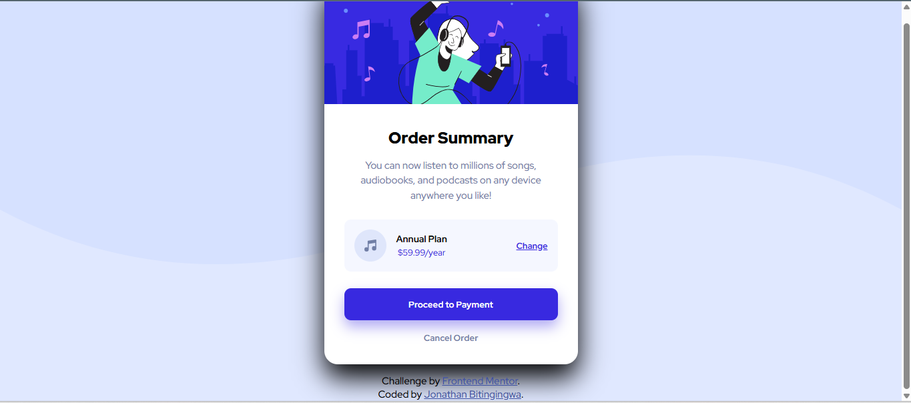

# Frontend Mentor – Order Summary Component

This is my solution to the **Order Summary Component** challenge from Frontend Mentor.
The goal of this project is to practice building a clean and responsive UI using **HTML and CSS**.

Challenge link: https://www.frontendmentor.io/challenges/order-summary-component-QlPmajDUj

---

## Project Objective

The objective of this project is to:

* Practice writing **semantic HTML**
* Improve **CSS layout and styling**
* Learn how to **replicate a design from a mockup**
* Practice **responsive design basics**
* Learn to manage code using **Git and GitHub**

This project is part of a **mentor–mentee learning program** from MichaelKentBurns' training site focused on improving web development skills.

---

## Technologies Used

* HTML5
* CSS3

No frameworks or libraries were used for this challenge.

---

## Screenshot



## Project Structure

```
project-folder/
│
├── index.html
├── style.css
├── images/
└── README.md
```

---

## Responsive Design

The layout is designed to work on:

* Mobile devices
* Tablets
* Desktop screens

---

## What I Learned

In this project Students will practice:

* Structuring a webpage with **semantic HTML**
* Using **Flexbox** for layout
* Managing spacing and alignment in CSS
* Matching a UI design as closely as possible

---

## Challenges I Faced
One of the main challenges I faced was: 

* Aligning the plan section correctly using Flexbox 

* Making sure the design spacing matched the reference design

* Adjusting the shadow and colors to closely match the design

By experimenting with CSS properties like box-shadow, gap, and flex alignment, I was able to solve these issues.


## Author

Frontend Mentor Challenge completed as part of a **mentorship program for beginner frontend developers** - [MichaelkentBurns](michaelkentburns.com) / Cohort-3.

Mentee: Jonathan Bitingingwa  
Mentor: Samuel Bitingingwa  
FreeDev Group.